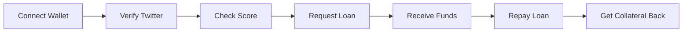
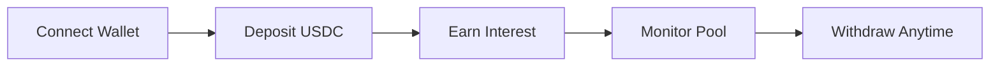

# Quick Start Guide

Get UnCollateral running in 5 minutes.

## For Users (Borrowers & Lenders)

### Prerequisites
- MetaMask wallet installed
- Some ETH for gas fees
- USDC for lending or ETH for collateral

### Steps

1. **Visit the Application**
   ```
   https://uncollateral.app (when deployed)
   ```

2. **Connect Your Wallet**
   - Click "Connect Wallet"
   - Approve MetaMask connection

3. **For Borrowers**:

   a. **Verify Your Reputation**:
   - Go to "Verify Reputation" tab
   - Click "Verify Twitter Account"
   - Complete Reclaim Protocol verification
   - Receive your reputation score

   b. **Request a Loan**:
   - Go to "Borrow" tab
   - Enter loan amount (e.g., 1000 USDC)
   - Select duration (e.g., 30 days)
   - See required collateral based on your score
   - Approve collateral token (ETH)
   - Click "Request Loan"
   - Confirm transaction in MetaMask

   c. **Repay Your Loan**:
   - Go to "My Loans" tab
   - View active loans
   - Click "Repay Loan"
   - Approve repayment amount
   - Confirm transaction
   - Receive collateral back

4. **For Lenders**:

   a. **Deposit Liquidity**:
   - Go to "Lend" tab
   - Enter deposit amount (e.g., 5000 USDC)
   - Approve USDC
   - Click "Deposit"
   - Confirm transaction

   b. **Earn Interest**:
   - Interest accrues automatically
   - View earnings in dashboard

   c. **Withdraw**:
   - Enter withdrawal amount (or 0 for all)
   - Click "Withdraw"
   - Receive principal + interest

## For Developers

### Quick Setup

```bash
# Clone repository
git clone https://github.com/YOUR-REPO/UnCollateral.git
cd UnCollateral

# Setup everything
make setup

# Or manual setup:
cd contracts
forge install
forge build
forge test

cd ../frontend
npm install
npm run dev
```

### Deploy to Testnet

```bash
# Configure environment
cd contracts
cp .env.example .env
# Edit .env with your keys

# Deploy
make deploy-sepolia
```

### Run Locally

```bash
# Terminal 1: Start local blockchain
anvil

# Terminal 2: Deploy contracts
cd contracts
forge script script/Deploy.s.sol --rpc-url http://localhost:8545 --broadcast

# Terminal 3: Start frontend
cd frontend
npm run dev
```

## Common Workflows

### Borrower Workflow



### Lender Workflow



## Testnet Faucets

Get testnet tokens for testing:

**Sepolia ETH**:
- https://sepoliafaucet.com
- https://www.alchemy.com/faucets/ethereum-sepolia

**Sepolia USDC** (Mock):
- Deploy mock ERC20 or use existing testnet USDC

## Example Scenarios

### Scenario 1: High Reputation Borrower

```
Reputation Score: 850/1000
Loan Request: 10,000 USDC
Duration: 30 days
Required Collateral: 55% = 5,500 USDC worth of ETH
Interest Rate: 5% APR
Total Repayment: 10,041 USDC
```

### Scenario 2: Medium Reputation Borrower

```
Reputation Score: 650/1000
Loan Request: 5,000 USDC
Duration: 60 days
Required Collateral: 105% = 5,250 USDC worth of ETH
Interest Rate: 10% APR
Total Repayment: 5,082 USDC
```

### Scenario 3: Lender

```
Deposit: 50,000 USDC
Pool Utilization: 70%
Average Interest: 8% APR
Monthly Earnings: ~333 USDC
Annual Return: ~4,000 USDC (8% of 50k)
```

## Troubleshooting

### "Insufficient collateral" error
- Check your reputation score
- Verify required collateral ratio
- Ensure you have enough collateral tokens

### "Reputation expired" error
- Re-verify your Twitter account
- Reputation is valid for 30 days

### "Insufficient liquidity" error
- Pool doesn't have enough funds
- Try smaller loan amount
- Check pool statistics

### Transaction fails
- Ensure you have enough ETH for gas
- Check token approvals
- Verify all amounts are correct

## Next Steps

- Read full [README](../README.md)
- Check [API Documentation](API.md)
- Review [Security](SECURITY.md)
- Join our community (Discord/Telegram)

## Support

- GitHub Issues: Report bugs
- Discord: Get help
- Email: support@uncollateral.app
